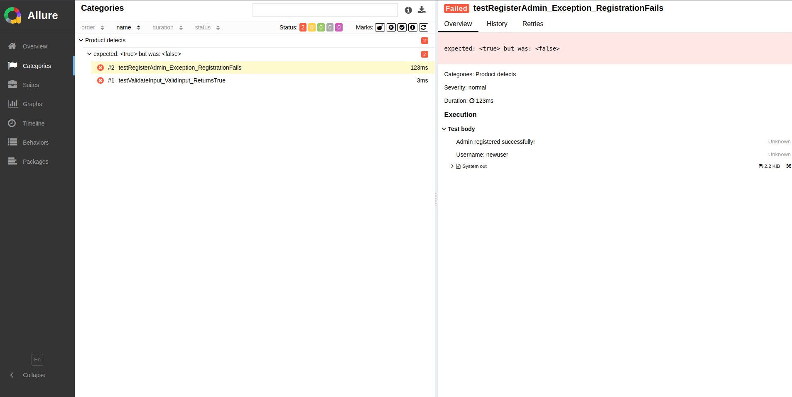

# Test documentations 

## Tech Stack

- Java
- Junit5
- Mockito
- Allure

## Project Structure

```
inventory-management/
├── src/test/
│   ├── java/
│   │   └── com/lestarieragemilang/desktop/
│   │       └── utils/unit # Unit test          
│   └── resources/
│           └── allure/screenshots # screenshots for README.md

```

## Start test and create Allure report

1. install allure
```shell
allure --version
```

2. start test
```shell
mvn clean test 
```

3. generate allure reports and open browser 
```shell
allure serve target/surefire-reports/
```


